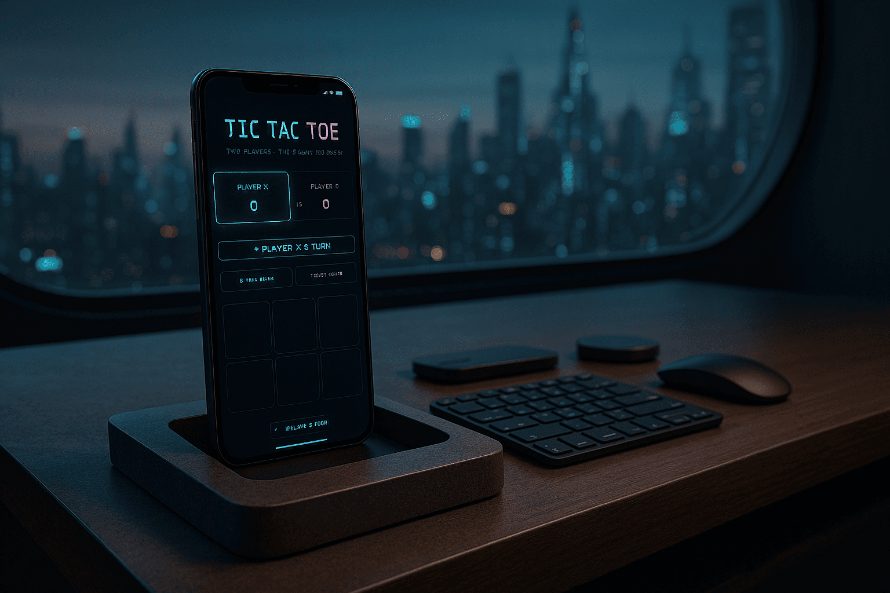

# 🎮 Tic Tac Toe

A fun and stylish Tic Tac Toe game built with HTML, Tailwind CSS, and JavaScript. Play against a friend in 2-player mode with smooth design and infinite replays.

## 🌟 Features

- 🎨 Custom color palette and modern design  
- 👫 2-player game logic (no AI)  
- ⚡ Quick and responsive layout  
- 🔁 Game reset button for instant replays  
- ♾️ Automatic game restarts for infinite gameplay  

## 🧰 Tech Stack

- HTML  
- Tailwind CSS  
- Vanilla JavaScript  

## 🚀 Live Demo

Try it here 👇  
https://zeddy-forreal.github.io/tic-tac-toe

## 📸 Preview



## 📁 How to Run Locally

```bash
git clone https://github.com/zeddy-forreal/tic-tac-toe.git
cd tic-tac-toe
# Then open index.html in your browser

